# shell

The `rancher/shell` image is used:

- When you install a chart in Rancher (Helm Chart or Rancher Chart)
- When you use `Kubectl Shell` when managing a cluster in Rancher

---
## Branches and Releases
This is the current branch strategy for `rancher/shell`, it may change in the future.

| Branch          | Tag      | Rancher                |
|-----------------|----------|------------------------|
| `main`          | `head`   | `main` branch (`head`) |
| `release/v2.10` | `v0.3.x` | `v2.10.x`              |
| `release/v2.9`  | `v0.2.x` | `v2.9.x`               |
| `release/v2.8`  | `v0.1.x` | `v2.8.x`               |

### Branch Info Overview

Each shell branch must constrain itself to use versions compatible with the respective Rancher releases.
Specifically to ensure maximum possible compatibility with the k8s versions that the Rancher release it targets supports.

Always refer to the [Support Compatability Matrix](https://www.suse.com/suse-rancher/support-matrix/) (or internal docs for future releases) as an official to ensure compatability.
That said, here a quick visual reference (Aug 2024):

```mermaid

gantt
    title k8s versions supported by `rancher/rancher`
    todayMarker off
    dateFormat X
    axisFormat 1.%S
    tickInterval 1second
    section Rancher
        2.8.X           :25,28
        2.9.X           :27,30
        2.10.X           :28,31
        2.11.X           :30,32
```

